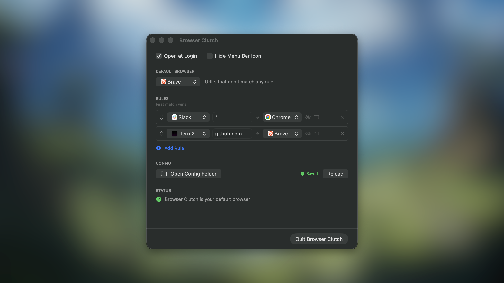
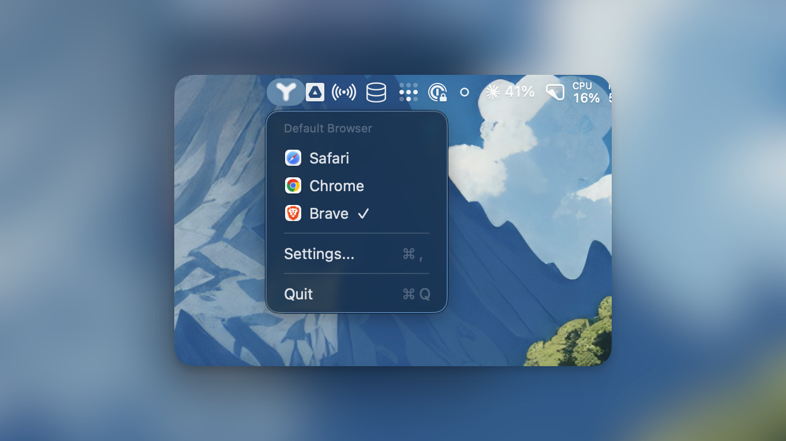

<p align="center">
  
</p>

<h1 align="center">Browser Clutch ®</h1>

<p align="center">
  <strong>A browser picker for macOS that routes URLs to different browsers based on rules.</strong><br><br>
  Tired of all links opening in the wrong browser? Browser Clutch sits in your menu bar<br>
  and intercepts every URL click. Set rules by source app or domain pattern —<br>
  Slack links open in Chrome, GitHub in Firefox, everything else in your default browser.
</p>

<p align="center">
  <a href="https://browserclutch.com">browserclutch.com</a>
</p>

<p align="center">
  <a href="../../releases/latest">
    
  </a>
  
  
</p>

---

## Features

- **Source-based routing** — Route URLs based on which app opened them
- **Domain-based routing** — Match exact domains, wildcards, or patterns
- **Priority rules** — Control which rule wins when multiple match
- **Private/Incognito mode** — Open URLs in private browsing mode
- **New window option** — Force URLs to open in a new browser window
- **Menu bar app** — Lives quietly in your menu bar
- **Settings panel** — Configure rules, default browser, and preferences
- **About panel** — View app version and info
- **XDG config** — Uses `~/.config/browserclutch/`
- **Zero config start** — Works out of the box with sensible defaults

---

## Screenshots

<p align="center">
  
    <br><br>
  
</p>

---

## Installation

1. Download the latest DMG from [**Releases**](../../releases/latest)
2. Open the DMG and drag **Browser Clutch ®** to Applications
3. Launch Browser Clutch ®
4. Right-click → Open (first time only, to bypass Gatekeeper)
5. Authorize the app in Settings -> Security & Privacy -> "Browser Clutch ®" -> Open Anyway
6. Set as default browser: **System Settings → Desktop & Dock → Default web browser**

---

## FAQ

<details>
<summary><strong>How do I set Browser Clutch ® as my default browser?</strong></summary>
<br>
System Settings → Desktop & Dock → Default web browser → Browser Clutch ®
</details>

<details>
<summary><strong>Why does macOS say the app is damaged or unverified?</strong></summary>
<br>
The app isn't notarized yet. Right-click the app → Open, then click Open in the dialog.
</details>

<details>
<summary><strong>Where is the config?</strong></summary>
<br>
<code>~/.config/browserclutch/config.json</code>
</details>

<details>
<summary><strong>Where are the logs?</strong></summary>
<br>
<code>~/.config/browserclutch/debug.log</code>
</details>

<details>
<summary><strong>How do I configure rules?</strong></summary>
<br>
Open Browser Clutch ® from the menu bar and use the Settings to add rules.
</details>

---

## Pattern Examples

Domain patterns support wildcards and regex:

| Pattern | Matches | Description |
|---------|---------|-------------|
| `*.github.com` | `gist.github.com`, `raw.github.com` | Wildcard subdomain |
| `github.com` | `github.com` only | Exact match |
| `*google*` | `google.com`, `mail.google.com`, `google.co.uk` | Contains "google" |
| `^(?!.*mail).*google.*` | `google.com`, `docs.google.com` | Regex: google but NOT mail |
| `^.*\.(dev\|io)$` | `example.dev`, `app.io` | Regex: .dev or .io TLDs |

**Tip:** Use the Settings UI to add rules — no need to edit JSON manually.

---

## Roadmap

- [x] Private/Incognito mode support
- [x] Open in new window option
- [x] About panel
- [x] App menu with Settings shortcut
- [x] Use standard config directory (`~/.config/browserclutch/`)
- [ ] Chrome profile selection

---

## Contributing

1. Fork the repo
2. Create a feature branch (`git checkout -b feature/thing`)
3. Commit your changes
4. Push and open a PR

### Development

```bash
make build    # Build
make install  # Build + install to /Applications
make run      # Launch app
make logs     # View debug logs
```

---

## License

[Non-Commercial](LICENSE.md) — Free for personal use, no commercial use without permission.

---

<p align="center">
  <sub>⚠️ This app was partially vibe coded — it may contain bugs. Use at your own risk.</sub>
</p>
